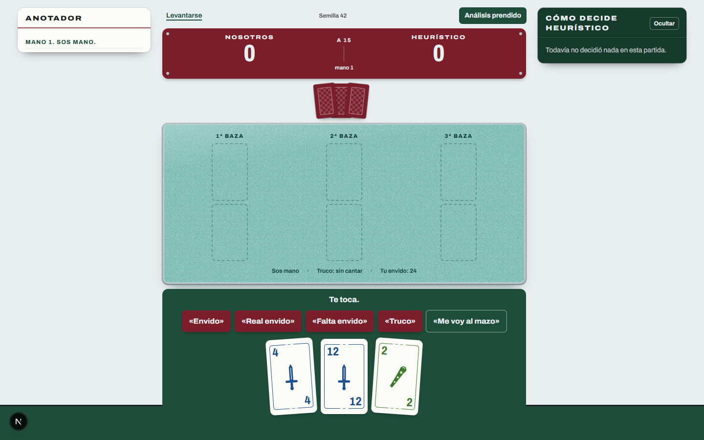

# Truco Bot

Truco argentino 1 vs 1 para jugar en el navegador contra bots de dificultad creciente: random, heurístico, CFR tabular, Deep CFR y PPO. Los bots que aprenden se entrenan por self-play, se exportan a msgpack u ONNX y los sirve una API sin PyTorch. En el modo análisis se ven las probabilidades que usó el bot en cada decisión.

Prioridades: un motor correcto y testeado, un piloto jugable y experimentos reproducibles.



## Demo

El deploy (Vercel + Railway) está preparado pero no publicado: ver [docs/deploy.md](docs/deploy.md). Localmente:

```bash
docker compose up --build   # API en http://localhost:8000 y web en http://localhost:3000
```

## Cómo se juega en la app

1. En la cartelera elegís rival, partida a 15 o 30 puntos y, opcionalmente, una semilla para repetir el reparto.
2. En la mesa tocás una carta para tirarla o cantás con las chapitas. Solo aparecen las acciones legales que manda la API; el front no conoce reglas.
3. El bot responde con frases citadas («Quiero retruco»). En el tanteador, los palitos se anotan en cuadrados de cinco.
4. Con **Análisis** prendido se ve la policy del bot: la probabilidad de cada acción y la que salió sorteada. Las cartas ocultas del bot nunca se nombran ([ADR 0014](docs/decisions/0014-textos-y-policy-desde-la-api.md)).

## Resultados

Todos los números salen de corridas con semilla registrada. Las cifras exactas, los comandos y las observaciones están en [docs/experiments/](docs/experiments/).

| Bot | Resultado | Registro |
|---|---|---|
| Heurístico vs random | gana el 95,2% de 2000 partidas a 15 (IC 95% del random: [0,039; 0,058]) | [torneo básico](docs/experiments/2026-09-18-tournament-basic.md) |
| MCCFR en Kuhn | valor −0,05594 (teórico −1/18), explotabilidad exacta 0,0039 | [Kuhn](docs/experiments/2026-09-18-mccfr-kuhn.md) |
| MCCFR tabular `sin_envido` | −0,148 puntos por mano vs heurístico, 43% de fallback | [truco tabular](docs/experiments/2026-09-18-mccfr-truco-tabular.md) |
| Deep CFR, PPO, MCCFR `completo` | corridas pendientes (se cortaron por falta de memoria al correr en paralelo) | — |

Curvas: `reports/curves/mccfr.png`. Motor: 3.646 manos/s random vs random ([benchmark](docs/experiments/2026-09-18-benchmark-random-vs-random.md)).

## Arquitectura

```text
engine/    motor de reglas puro (dataclasses inmutables, legal_actions/apply puras) y agentes servibles
api/       FastAPI: partidas humano vs bot, registro de modelos (msgpack / ONNX Runtime)
web/       Next.js: la mesa "Sede del club de barrio" (ver web/DESIGN.md)
training/  Kuhn, truco_hand, MCCFR, Deep CFR, MaskablePPO, evaluación y export
models/    metadata.json por modelo (los binarios van fuera de Git)
docs/      reglas, contrato de acciones y observaciones, decisiones (ADR) y experimentos
```

- Reglas implementadas: [docs/rules.md](docs/rules.md). Contrato v1 de acciones, `info_key` y `encode` (317 posiciones): [docs/action-space.md](docs/action-space.md).
- Arquitectura y flujos: [docs/architecture.md](docs/architecture.md). Entrenamiento: [docs/training.md](docs/training.md). Evaluación: [docs/evaluation.md](docs/evaluation.md).
- Decisiones de diseño: [docs/decisions/](docs/decisions/). Roadmap y estado: [docs/roadmap.md](docs/roadmap.md).

## Desarrollo

```bash
uv sync --all-groups && pnpm install

# API y web sin Docker
uv run uvicorn app.main:app --app-dir api --reload
pnpm dev

# Validaciones (las mismas que corre la CI)
uv run ruff format --check . && uv run ruff check . && uv run mypy engine api training
uv run pytest
pnpm lint && pnpm typecheck && pnpm test

# Contrato OpenAPI y tipos del front
uv run python -m app.export_openapi api/openapi.json && pnpm gen:api
```

## Reproducir los experimentos

```bash
uv run truco-train train --config training/configs/mccfr_kuhn.yaml
uv run truco-train train --config training/configs/mccfr_truco_sin_envido.yaml
uv run truco-train train --config training/configs/mccfr_truco_completo.yaml
uv run truco-train train --config training/configs/deep_cfr_truco.yaml
uv run truco-train train --config training/configs/ppo_truco.yaml

# Exportar (artifacts/ + .model_cache/ + models/<nombre>/metadata.json)
uv run truco-train export --config training/configs/deep_cfr_truco.yaml   # idem para cada corrida

# Evaluar
uv run truco-train eval tournament --config training/configs/tournament_full.yaml
uv run truco-train eval exploit --config training/configs/exploitability.yaml
uv run truco-train eval curves runs/deep_cfr_truco runs/ppo_truco --out reports/curves/redes.png
uv run python engine/benchmarks/random_vs_random.py --games 2000 --seed 0
```

## Stack

Python 3.12 con `uv`, FastAPI, Pydantic v2, NumPy, ONNX Runtime; Next.js (App Router), TypeScript strict, Tailwind 4, Zustand y `pnpm`; PyTorch (CPU), Gymnasium y `sb3-contrib` para entrenar; pytest, Hypothesis, mypy strict, Ruff, ESLint, Vitest y GitHub Actions; Docker Compose.
