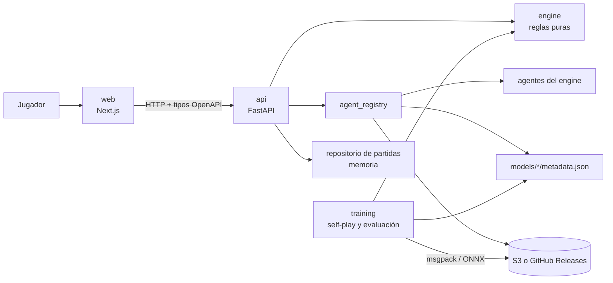
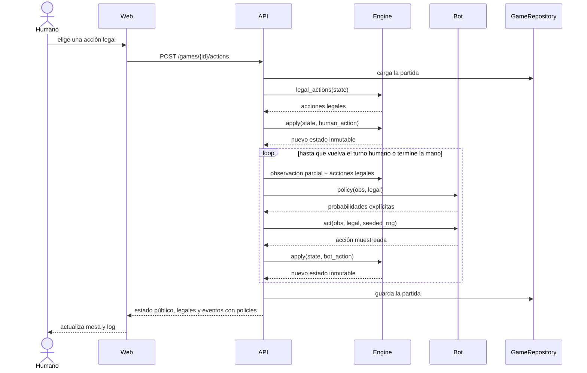
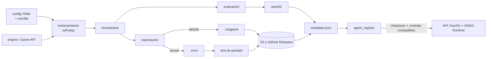
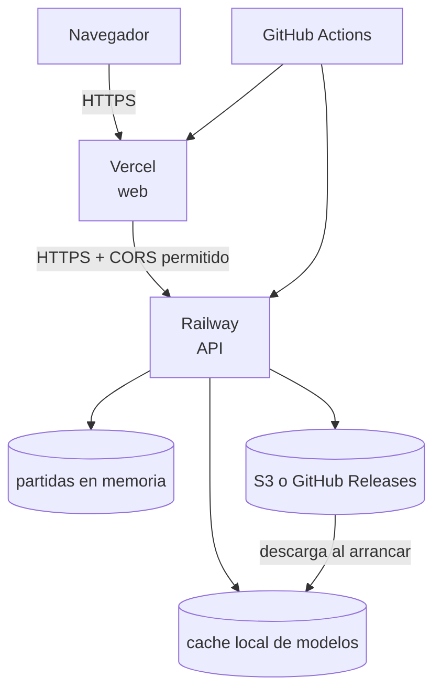

# Arquitectura

## Componentes del monorepo

`engine/` es el núcleo compartido. No conoce HTTP, interfaces web ni frameworks de ML. `training/` consume el motor mediante adaptadores y exporta artefactos que `api/` puede servir sin PyTorch. `web/` trata a la API como única autoridad sobre el estado y las acciones legales.

## Secuencia de una jugada

Una acción fuera de la lista legal produce HTTP 422. El front no valida reglas por su cuenta.

## Entrenamiento, exportación y serving

El metadata registra procedencia, versión del contrato, checksum y resultados. La API rechaza un artefacto cuyo contrato no coincida con el motor desplegado.

## Deploy

La web recibe la URL pública de la API por variable de entorno. La API configura los orígenes CORS permitidos por variable de entorno. El repositorio de partidas en memoria se pierde al reiniciar o reemplazar la instancia.
